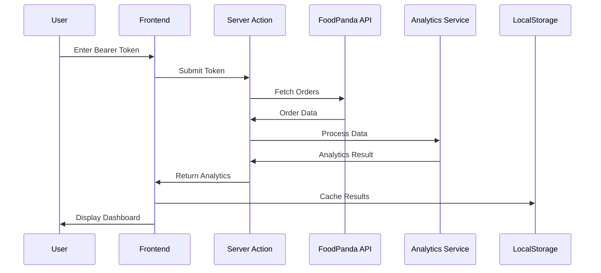

# 🐼 FoodPanda Analytics

A production-ready Next.js 16 application that provides comprehensive analytics and insights for your FoodPanda order history. Visualize spending patterns, discover dining habits, and gain actionable insights from your food delivery data.


## ✨ Features

### 📊 Analytics Dashboard
- **Spending Analysis**: Track total spending, average order value, and savings from vouchers
- **Monthly Trends**: Visualize spending patterns over time with interactive charts
- **Restaurant Insights**: Discover your favorite restaurants and loyalty patterns
- **Food Categories**: Analyze your cuisine preferences and dining habits
- **Payment Methods**: Breakdown of how you pay for orders

### 🎯 Smart Insights
- Personalized insights based on your ordering behavior
- Spending categorization (Budget-Conscious, Moderate, Big Spender)
- Peak ordering hours and days analysis
- Voucher usage effectiveness tracking

### 🔒 Privacy-First Design
- **100% Client-Side Processing**: Your data never leaves your browser
- **No Server Storage**: Bearer tokens are processed locally and discarded
- **Secure Headers**: Comprehensive security headers including CSP, HSTS, XSS protection
- **Rate Limiting**: Built-in protection against abuse

### ⚡ Performance Optimized
- **Local Caching**: Smart cache system with TTL and compression
- **Code Splitting**: Optimized bundle sizes with lazy loading
- **MUI X Charts**: Premium data visualization components
- **Framer Motion**: Smooth animations without performance impact

## 🛠️ Technology Stack

| Category | Technologies |
|----------|-------------|
| **Framework** | Next.js 16.1.4 (App Router) |
| **Runtime** | React 19.2.3 |
| **Language** | TypeScript 5.x |
| **Styling** | Tailwind CSS 4, CSS Variables |
| **UI Components** | shadcn/ui, Radix UI Primitives |
| **Charts** | MUI X Charts 8.x |
| **Animations** | Framer Motion 12.x |
| **Validation** | Zod 4.x |
| **Forms** | React Hook Form 7.x |
| **State** | React 19 useActionState |
| **Icons** | Lucide React |

## 🚀 Getting Started

### Prerequisites

- Node.js 18.17+ or 20.x (recommended)
- npm 9+ or pnpm 8+

### Installation

1. **Clone the repository**
   ```bash
   git clone https://github.com/KamrulIslamArnob/foodpanda-analytics-dashboard-testing-prod.git
   cd foodpanda-analytics-dashboard-testing-prod
   ```

2. **Install dependencies**
   ```bash
   npm install
   # or
   pnpm install
   ```

3. **Set up environment variables**
   ```bash
   cp .env.example .env.local
   ```
   
   Edit `.env.local` with your configuration (see [Environment Variables](#environment-variables)).

4. **Start the development server**
   ```bash
   npm run dev
   ```

5. **Open your browser**
   Navigate to [http://localhost:3000](http://localhost:3000)

## 📁 Project Structure

```
next_frontend/
├── public/                    # Static assets
│   └── favicon.ico
├── src/
│   ├── app/                   # Next.js App Router
│   │   ├── actions/           # Server Actions
│   │   │   └── analyze.ts     # Token processing action
│   │   ├── analyze/           # Analytics page route
│   │   │   └── page.tsx
│   │   ├── globals.css        # Global styles & design tokens
│   │   ├── layout.tsx         # Root layout
│   │   └── page.tsx           # Landing page
│   ├── components/
│   │   ├── dashboard/         # Analytics components
│   │   │   ├── analytics-view.tsx
│   │   │   ├── charts/        # MUI X Chart components
│   │   │   │   └── mui-charts.tsx
│   │   │   └── token-guide.tsx
│   │   ├── guest/             # Guest mode components
│   │   │   └── token-input.tsx
│   │   ├── layout/            # Layout components
│   │   └── ui/                # shadcn/ui components
│   ├── hooks/                 # Custom React hooks
│   │   └── use-analytics-cache.ts
│   ├── lib/                   # Utilities & services
│   │   ├── cache/             # Client-side caching system
│   │   │   ├── cache-manager.ts
│   │   │   └── index.ts
│   │   ├── services/          # Business logic
│   │   │   ├── analytics.service.ts
│   │   │   └── foodpanda.service.ts
│   │   ├── constants.ts       # App constants
│   │   └── utils.ts           # Utility functions
│   └── types/                 # TypeScript definitions
│       └── index.ts
├── middleware.ts              # Rate limiting & request handling
├── next.config.ts             # Next.js configuration
├── tailwind.config.ts         # Tailwind configuration
└── tsconfig.json              # TypeScript configuration
```

## 🔐 Environment Variables

Create a `.env.local` file in the project root:

```bash
# Application
NEXT_PUBLIC_APP_URL=http://localhost:3000

# Optional: Enable verbose logging in development
# NODE_ENV=development
```

> **Note**: This application is designed to work without any required environment variables. All data processing happens client-side.

## 📜 Available Scripts

| Command | Description |
|---------|-------------|
| `npm run dev` | Start development server with hot reload |
| `npm run build` | Create optimized production build |
| `npm run start` | Start production server |
| `npm run lint` | Run ESLint for code quality |
| `npm run type-check` | Run TypeScript type checking |

## 🔒 Security Features

This application implements comprehensive security measures:

### Headers (via `next.config.ts`)
- **Content-Security-Policy**: Strict CSP with approved sources
- **Strict-Transport-Security**: HSTS with 2-year max-age
- **X-Frame-Options**: Clickjacking protection
- **X-Content-Type-Options**: MIME sniffing prevention
- **X-XSS-Protection**: XSS filter enabled
- **Referrer-Policy**: Controlled referrer information
- **Permissions-Policy**: Restricted browser features

### Request Protection (via `middleware.ts`)
- **Rate Limiting**: 10 requests per minute per IP on sensitive endpoints
- **Input Validation**: Zod schema validation for all user inputs
- **Token Sanitization**: Bearer tokens validated with JWT pattern matching

### Data Privacy
- No persistent server-side storage of user data
- Tokens are processed in-memory and never logged
- Client-side caching with automatic expiration

## 🚀 Deployment

### Vercel (Recommended)

1. **Connect Repository**
   - Go to [Vercel Dashboard](https://vercel.com/dashboard)
   - Click "Import Project"
   - Select your Git repository

2. **Configure Project**
   - Framework Preset: Next.js
   - Root Directory: `next_frontend`
   - Build Command: `npm run build`
   - Output Directory: `.next`

3. **Environment Variables**
   - Add any required environment variables in Vercel dashboard

4. **Deploy**
   - Click "Deploy" and wait for build completion

### Self-Hosted

```bash
# Build the application
npm run build

# Start production server
npm run start

# Or use PM2 for process management
pm2 start npm --name "foodpanda-analytics" -- start
```

## 📊 How It Works

1. **Token Input**: User provides their FoodPanda bearer token
2. **Fetch Orders**: Server Action fetches order history from FoodPanda API
3. **Analyze Data**: Analytics service processes orders into insights
4. **Display Results**: Interactive dashboard visualizes the data
5. **Cache Locally**: Results cached in browser for quick access



## 🐛 Troubleshooting

### Common Issues

**"Invalid or expired token"**
- Ensure you're logged into FoodPanda
- Get a fresh token from Network tab (Developer Tools)
- Check that you copied the complete "Bearer ..." value

**"No orders found"**
- Verify your FoodPanda account has order history
- Token may be for a different account/region

**Charts not loading**
- Clear browser cache and refresh
- Check browser console for JavaScript errors

**Build errors**
- Run `npm install` to ensure all dependencies are installed
- Clear `.next` folder and rebuild: `rm -rf .next && npm run build`

### Getting Help

1. Check existing [GitHub Issues](https://github.com/KamrulIslamArnob/foodpanda-analytics-dashboard-testing-prod/issues)
2. Create a new issue with:
   - Steps to reproduce
   - Expected vs actual behavior
   - Browser and OS information
   - Console errors (if any)

## 🤝 Contributing

Contributions are welcome! Please follow these steps:

1. **Fork the repository**
2. **Create a feature branch**
   ```bash
   git checkout -b feature/amazing-feature
   ```
3. **Make your changes**
   - Follow existing code style
   - Add tests if applicable
   - Update documentation
4. **Commit your changes**
   ```bash
   git commit -m 'feat: add amazing feature'
   ```
5. **Push to your fork**
   ```bash
   git push origin feature/amazing-feature
   ```
6. **Open a Pull Request**

### Commit Convention

We follow [Conventional Commits](https://www.conventionalcommits.org/):

- `feat:` New features
- `fix:` Bug fixes
- `docs:` Documentation changes
- `style:` Code style changes (formatting)
- `refactor:` Code refactoring
- `perf:` Performance improvements
- `test:` Test additions/changes
- `chore:` Maintenance tasks

## 📄 License

This project is licensed under the MIT License - see the [LICENSE](LICENSE) file for details.

## 🙏 Acknowledgments

- [FoodPanda](https://www.foodpanda.com) for the delivery platform
- [Vercel](https://vercel.com) for Next.js and hosting
- [shadcn/ui](https://ui.shadcn.com) for beautiful components
- [MUI](https://mui.com) for charting library

---

<p align="center">
  Made with ❤️ for food lovers who love data
</p>
